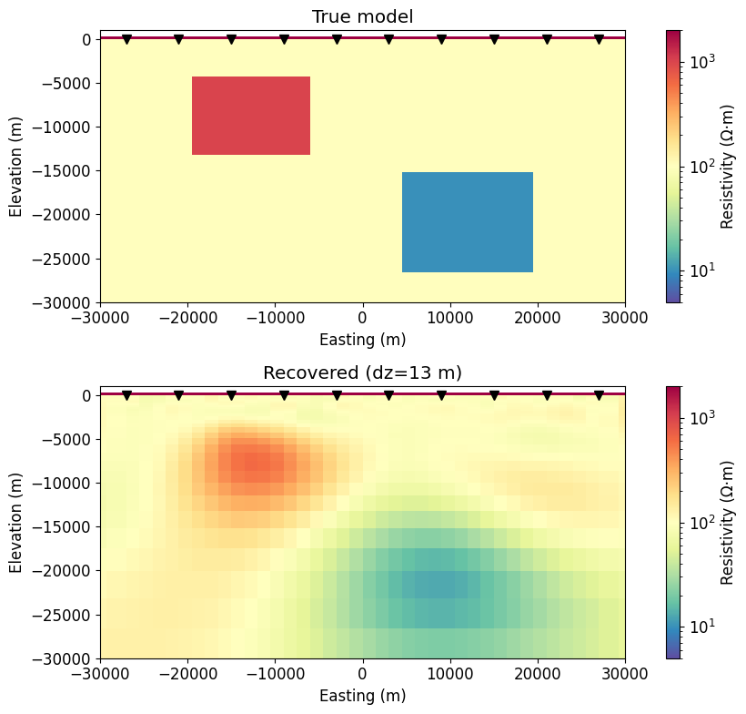
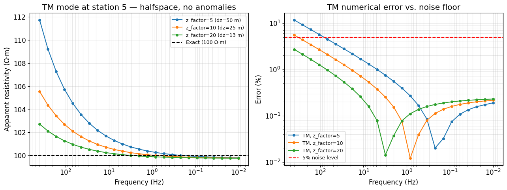
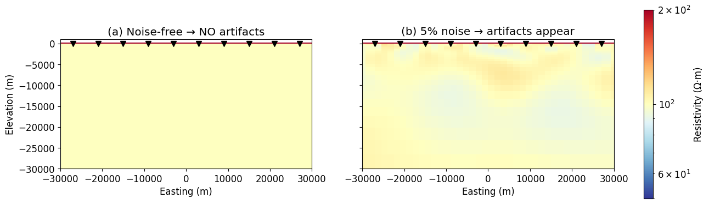

# 2D Forward Modelling and Inversion of Magnetotelluric (MT) Data via SimPEG

A learning project on 2D magnetotelluric (MT) forward modelling and deterministic inversion using [SimPEG](https://simpeg.xyz). A synthetic Earth model (a resistor and a conductor in a 100 Ω·m background) is built, its TE and TM responses are simulated, noise is added, and the data are inverted to recover the model. A second notebook then checks the numerical accuracy of the setup and investigates where artifacts in the recovered model come from.



---

## Repository structure

```
2D-Forward-modeling-and-Inversion-via-SimPEG/
├── README.md
├── requirements.txt
├── notebooks/
│   ├── 01_forward_and_inversion_baseline.ipynb
│   └── 02_mesh_validation_and_noise_diagnosis.ipynb
└── figures/            # plots exported from the notebooks
```

| Notebook | What it does |
|---|---|
| **01 – Baseline** | First complete workflow: survey design, skin-depth–based mesh, synthetic model, TE/TM forward modelling, noise, smooth (L2) inversion, data-fit check. Surface cell size 50 m. |
| **02 – Validation & diagnosis** | Continues from 01. Tests the forward code against the exact half-space solution, refines the near-surface mesh (50 m → 13 m), runs a controlled half-space inversion with and without noise, and re-runs the main inversion. **Recommended notebook to read.** |

Notebook 01 is kept on purpose: it shows the starting point of the study, and notebook 02 documents what was checked and changed afterwards.

---

## Theory

### 1. Governing equations

MT uses natural electromagnetic fields as the source. At MT frequencies displacement currents are negligible (quasi-static approximation), so Maxwell's equations in the frequency domain are

$$
\nabla \times \mathbf{E} = -i\omega\mu_0 \mathbf{H}, \qquad
\nabla \times \mathbf{H} = \sigma \mathbf{E}
$$

where $\omega = 2\pi f$, $\sigma$ is electrical conductivity (S/m) and $\mu_0 = 4\pi \times 10^{-7}$ H/m.

### 2. 2D Earth: TE and TM modes

If conductivity varies only in $x$ (profile direction) and $z$ (depth), and is constant along the geological strike $y$, the equations split into two independent polarizations:

**TE mode (E-polarization)** – electric field parallel to strike ($E_y$, $H_x$, $H_z$):

$$
\frac{\partial^2 E_y}{\partial x^2} + \frac{\partial^2 E_y}{\partial z^2} = i\omega\mu_0\sigma E_y
$$

**TM mode (H-polarization)** – magnetic field parallel to strike ($H_y$, $E_x$, $E_z$):

$$
\frac{\partial}{\partial x}\left(\rho \frac{\partial H_y}{\partial x}\right) + \frac{\partial}{\partial z}\left(\rho \frac{\partial H_y}{\partial z}\right) = i\omega\mu_0 H_y, \qquad \rho = 1/\sigma
$$

In SimPEG these are solved by

| Mode | Impedance | SimPEG simulation | Receiver orientation |
|---|---|---|---|
| TE | $Z_{yx} = E_y / H_x$ | `Simulation2DMagneticField` | `"yx"` |
| TM | $Z_{xy} = E_x / H_y$ | `Simulation2DElectricField` | `"xy"` |

### 3. Observed quantities: apparent resistivity and phase

$$
\rho_a = \frac{|z|^2}{\omega\mu_0}, \qquad \phi = \arg(z) = \tan^{-1}\!\left(\frac{\operatorname{Im} z}{\operatorname{Re} z}\right)
$$

Over a uniform half-space, $\rho_a$ equals the true resistivity at every frequency and $|\phi| = 45^\circ$. This exact solution is used as a benchmark in notebook 02. SimPEG returns the TM ($Z_{xy}$) phase in a different quadrant than the TE phase, so the notebooks add 180° to the TM phase when plotting.

### 4. Skin depth and mesh design

The skin depth is the distance over which fields decay by a factor $1/e$:

$$
\delta = \sqrt{\frac{2}{\omega\mu_0\sigma}} \approx 503\sqrt{\frac{\rho}{f}} \ \text{m}
$$

For $\rho = 100$ Ω·m: $\delta(400\ \text{Hz}) \approx 252$ m and $\delta(0.01\ \text{Hz}) \approx 50$ km. The mesh is built from these values rather than by hand:

- **Finest vertical cell** (resolves the highest frequency): $\Delta z_{min} = \delta(f_{max}) / n_z$, where $n_z$ = `z_factor_max`
- **Vertical padding depth** (lowest frequency must decay before the boundary): $L_z > n_z \cdot \delta(f_{min})$
- **Lateral padding**: $L_x > n_x \cdot \delta(f_{min})$, where $n_x$ = `x_factor_max`
- **Finest horizontal cell**: station spacing / `spacing_factor` (6000 / 4 = 1500 m)
- Cells grow geometrically away from the core ($h_{i+1} = p\,h_i$, $p$ = 1.15 downward, 1.5 laterally and into the air)

### 5. Inversion

**Model parameter.** The inversion solves for log-conductivity in the subsurface cells, $m = \ln\sigma$. This keeps $\sigma > 0$ and handles values spanning orders of magnitude. Air cells are fixed at $\sigma_{air} = 10^{-8}$ S/m:

$$
\sigma = \exp(m) \quad \text{(`ExpMap` · `InjectActiveCells`)}
$$

**Objective function** (Tikhonov regularization):

$$
\phi(m) = \phi_d(m) + \beta\,\phi_m(m)
$$

**Data misfit** – each datum weighted by its standard deviation $\varepsilon_i$:

$$
\phi_d = \left\| \mathbf{W}_d \big(F(m) - \mathbf{d}^{obs}\big) \right\|_2^2 = \sum_{i=1}^{N} \left(\frac{F_i(m) - d_i^{obs}}{\varepsilon_i}\right)^2
$$

with $\varepsilon = 5\%\,|\rho_a|$ for apparent resistivity and $\varepsilon = 2^\circ$ for phase. TE and TM misfits are summed.

**Model regularization** (smooth L2):

$$
\phi_m = \alpha_s \left\| \mathbf{W}_s (m - m_{ref}) \right\|^2 + \alpha_x \left\| \mathbf{W}_x \frac{\partial m}{\partial x} \right\|^2 + \alpha_z \left\| \mathbf{W}_z \frac{\partial m}{\partial z} \right\|^2
$$

with $\alpha_s = 10^{-10}$ (essentially no pull toward the reference model), $\alpha_x = 1$ and $\alpha_z = 0.5$ (in the code, `alpha_y` refers to the mesh's second axis, which is depth).

**Optimization.** Inexact Gauss–Newton. Each iteration solves

$$
\left(\mathbf{J}^\top \mathbf{W}_d^\top \mathbf{W}_d \mathbf{J} + \beta\,\nabla^2\phi_m\right)\delta m = -\nabla\phi(m)
$$

approximately with conjugate gradients, where $\mathbf{J} = \partial F / \partial m$ is the sensitivity matrix.

**Choosing β.**
- Initial value from the ratio of largest eigenvalues (`BetaEstimate_ByEig`): $\beta_0 = r \cdot \lambda_{max}(\nabla^2\phi_d) / \lambda_{max}(\nabla^2\phi_m)$, with $r = 1$
- Cooling (`BetaSchedule`): $\beta_{k+1} = \beta_k / 2$ every iteration
- Stopping (`TargetMisfit`): stop when $\phi_d \le \chi \cdot N$ with $\chi = 1$ and $N = 1000$ data, i.e. the data are fit to the noise level on average

---

## Synthetic experiment

| Parameter | Value |
|---|---|
| Stations | 10, spaced 6 km, from −27 to +27 km |
| Frequencies | 25, log-spaced 400 Hz → 0.01 Hz |
| Data | ρa and φ, TE + TM → 25 × 2 × 10 × 2 = 1000 data |
| Background | 100 Ω·m |
| Resistor | 1000 Ω·m, x = −20 to −6 km, depth 4–14 km |
| Conductor | 10 Ω·m, x = 4 to 20 km, depth 16–26 km |
| Noise | 5% Gaussian on ρa, 2° Gaussian on φ |
| Mesh (01 / 02) | 2,756 / 3,744 cells; surface cell 50 m / 13 m |

## Results

**Forward-modelling accuracy (half-space test, station 5).** Worst-case error against the exact 100 Ω·m solution:

| `z_factor_max` | Surface cell | TM error | TE error |
|---|---|---|---|
| 5 (notebook 01) | 50 m | 11.73% | 0.90% |
| 10 | 25 m | 5.54% | 0.57% |
| 20 (notebook 02) | 13 m | 2.72% | 0.41% |

The error decreases as the mesh is refined, as expected for a correct discretization. On the coarse mesh the high-frequency TM error was larger than the 5% noise level.



**Inversion.** Both inversions reach the target misfit (χ² ≈ 0.97–0.98). Both anomalies are recovered in the correct positions but smoothed, with reduced contrast (notebook 02: resistor block mean 369 Ω·m vs. true 1000; conductor block mean 22 Ω·m vs. true 10). This is the expected behaviour of a smooth L2 inversion.

**Noise experiment.** Inverting a noise-free half-space returns exactly 100 Ω·m everywhere. The same half-space with 5% noise returns values between 89 and 114 Ω·m. The small near-surface artifacts therefore come from fitting the noise, not from the mesh or solver.



## Limitations and lessons learned

- **Inverse crime.** The synthetic data and the inversion use the same mesh, so forward-modelling error cancels out. This is why refining the mesh improved forward accuracy but barely changed the recovered model. A fairer test would generate data on a fine mesh and invert on a different, coarser one.
- **Underdetermined problem.** 3,484 active cells vs. 1,000 data; the regularization decides the structure that the data cannot constrain.
- **Resistors are harder to resolve than conductors** with MT, which is consistent with the weaker recovery of the resistor.
- **Mesh generator coupling.** `z_factor_max` controls both the surface cell size and the padding depth, so raising it to 20 also pushed the mesh bottom to about 1,000 km. Separating these into two parameters would be cleaner.
- **Depth weighting.** `directives.UpdateSensitivityWeights` raised a shape error with 2D NSEM simulations in SimPEG 0.25.2 during this study, so it was not used.

## Getting started

```bash
git clone https://github.com/ThanaphonSIM/2D-Forward-modeling-and-Inversion-via-SimPEG.git
cd 2D-Forward-modeling-and-Inversion-via-SimPEG
pip install -r requirements.txt
jupyter notebook notebooks/
```

Tested with SimPEG 0.25.2. Notebook 01 takes about 1 minute; notebook 02 runs three inversions and takes a few minutes with the default `SolverLU`. Installing `pydiso` lets SimPEG use the faster Pardiso solver automatically.

## References

- Cockett, R., Kang, S., Heagy, L. J., Pidlisecky, A., & Oldenburg, D. W. (2015). SimPEG: An open source framework for simulation and gradient based parameter estimation in geophysical applications. *Computers & Geosciences*, 85, 142–154.
- Heagy, L. J., Cockett, R., Kang, S., Rosenkjaer, G. K., & Oldenburg, D. W. (2017). A framework for simulation and inversion in electromagnetics. *Computers & Geosciences*, 107, 1–19.
- Simpson, F., & Bahr, K. (2005). *Practical Magnetotellurics*. Cambridge University Press.
- The workflow is adapted from the SimPEG MT tutorial notebooks `2_2d_forward_modelling.ipynb` and `7_2d_inversion_synthetic.ipynb`. <!-- TODO: add link to the original tutorial repository -->

## Author

Thanaphon — <!-- TODO: affiliation / contact -->
